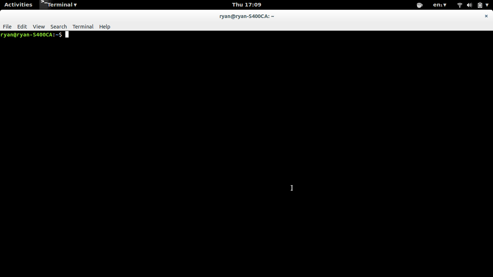

Polonium v0.2.1
========

 </img>

Polonium is a stateless password manager that creates
& retrieves passwords without storing them in a database.
The advantages to this approach are obvious; your database can't be
stolen, and you can get your passwords anywhere you can get polonium.

Polonium only requires you to remember one master password, from which it
derives subordinate passwords for your various service logins. Even if these
subordinate passwords are compromised the attacker cannot compromise your
master password.

### Requirements

* Ubuntu (possibly another Linux or UNIX), or Windows.
* Node.js >= v0.10.28
* Docopt
* Prompt
* Bignum

--------------------------------

### Linux Installation

#### - Dependencies

To install node.js on Ubuntu use

```
sudo add-apt-repository ppa:chris-lea/node.js
sudo apt-get update
sudo apt-get install nodejs
```

Polonium depends on the following libraries:

```
sudo npm install -g docopt
sudo npm install -g prompt
sudo npm install -g bignum
```

#### - Polonium

First, grab the repository from Github.

```
git clone https://github.com/rgrannell1/polonium
cd polonium
```

Run the following command.

```
sudo nano ~/.bashrc
```
add the line,

```
alias polo=path/to/polonium.py
```

Run

```
. ~/.bashrc
```

and you're ready to go. Now you can test the program with

```
polo create facebook
```

and

```
polo get facebook
```

--------------------------------

### Windows Installation *

#### - Dependencies

Get node.js through an [installer](http://nodejs.org/dist/v0.10.31/x64/node.exe) or your preferred method.

NPM should be bundled with node, so run the following from your terminal to globally install the 
required modules:

```
npm install -g docopt
npm install -g prompt
npm install -g bignum
```

#### - Polonium

Download and unzip [polonium](https://github.com/rgrannell1/polonium/archive/master.zip) from github. The 
file `lib/polonium.js` is directly executable by node.js, but to make life easier you should set up an environmental
variable aliasing the path to polonium as 'polo'.

This can be done using the following GUI:

`My Computer -> Properties -> Advanced System Settings -> Environmental Variables`

Click `New`, and give 'polo' as the variable name and the full path to lib/polonium.js as the value.

Now you can test the program by running the following from your terminal:

```
polo create facebook
```

and

```
polo get facebook
```

--------------------------------

### Details

Polonium is a shallow wrapper around node.js's implementation of
Password-Based Key Derivation Function 2 (PBKDF2); all polonium adds is
a method of gathering command-line arguments and converting the derived
keys to base62.

For more information on PBKDF2 see the following resources:

* [Wikipedia Page](https://en.wikipedia.org/wiki/PBKDF2)

* [NIST Recommendations](http://csrc.nist.gov/publications/nistpubs/800-132/nist-sp800-132.pdf)

#### - Master Password

You must not use your master password anywhere it may be compromised; if your
master password is compromised, all polonium-derived passwords will also be
cracked.

A good, XKCD-approved method of making a master password is to take you favourite large
dictionary - for example the Oxford English Dictionary - and choose five
or more random words as your password.


Taking the OED as an example, choosing five of its 170,000 words gets you 86 bits of entropy. If the
attacker does not know your choice of dictionary your security depends on the length of your
password.

#### - Iterations & Performance

Modern GPU-based cracking can make billions of attempts a day at password cracking, so even
passwords made by secure hashing algorithms can be cracked quickly. Polonium, or more accurately PBKDF2,
uses key-stretching to slow down brute force attacks.

High iteration counts waste the attacker's time and raises their electric bill, so polonium
spitefully defaults to a costly 1,000,000 iterations.

If this is too hard on your battery / device, set polonium to a number of iteration
preferably above 200,000 iterations.

#### - Password Encoding

Polonium passwords are base62-encoded. Although base16 and base64 are more common,
Base62 (alphanumeric) passwords are generally permitted by online services
and are entropy-dense compared to base16 passwords. Even short base62 passwords
exceed the recommended minimum of 80-bits of entropy per password.

### - Security Notes

Polonium passwords only have *application* specific salts, not user-specific salts.
Two users that share a salt ('facebook') and master password ('password123') will share
the same output password. Not every website will salt passwords properly, so use a
unique master password.


* Currently untested.


### Licence

The MIT License

Copyright (c) 2014 Ryan Grannell

Permission is hereby granted, free of charge, to any person obtaining a copy of this software and associated documentation files (the "Software"), to deal in the Software without restriction, including without limitation the rights to use, copy, modify, merge, publish, distribute, sublicense, and/or sell copies of the Software, and to permit persons to whom the Software is furnished to do so, subject to the following conditions:

The above copyright notice and this permission notice shall be included in all copies or substantial portions of the Software.

THE SOFTWARE IS PROVIDED "AS IS", WITHOUT WARRANTY OF ANY KIND, EXPRESS OR IMPLIED, INCLUDING BUT NOT LIMITED TO THE WARRANTIES OF MERCHANTABILITY, FITNESS FOR A PARTICULAR PURPOSE AND NONINFRINGEMENT. IN NO EVENT SHALL THE AUTHORS OR COPYRIGHT HOLDERS BE LIABLE FOR ANY CLAIM, DAMAGES OR OTHER LIABILITY, WHETHER IN AN ACTION OF CONTRACT, TORT OR OTHERWISE, ARISING FROM, OUT OF OR IN CONNECTION WITH THE SOFTWARE OR THE USE OR OTHER DEALINGS IN THE SOFTWARE.

### Versioning

Versioning complies with the Semantic Versioning 2.0.0 standard.

http://semver.org/
